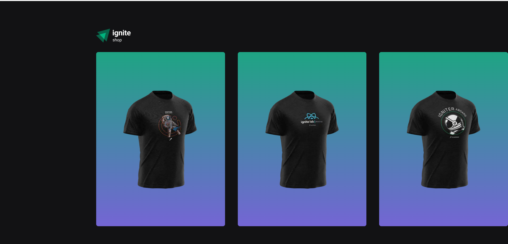
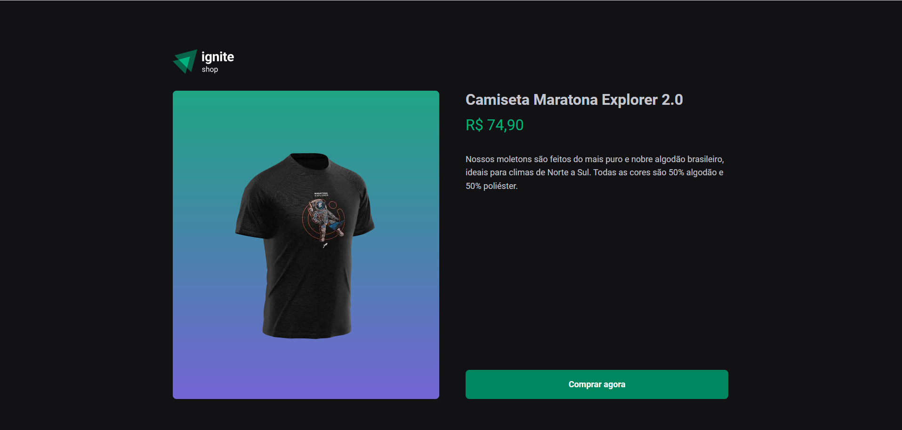
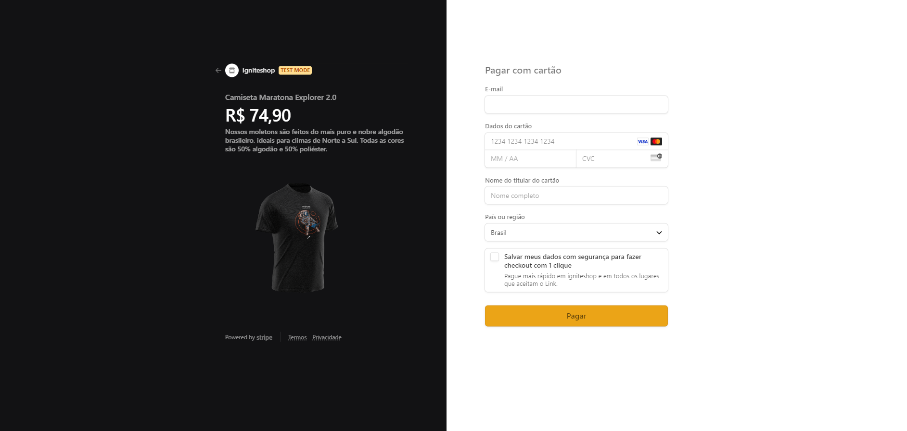
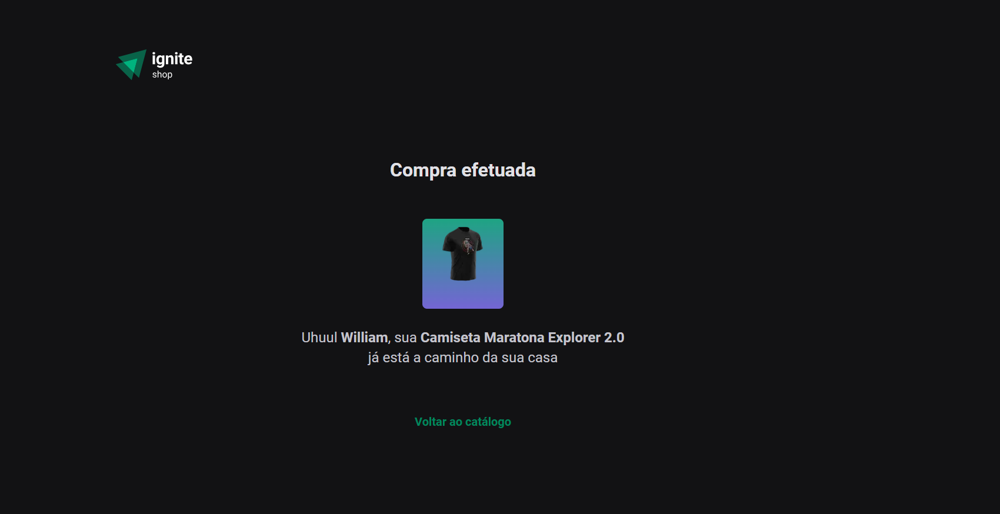

# Shop de Camisetas

Bem-vindo ao repositório do Shop de Camisetas! Este projeto é um e-commerce para a compra de camisetas com integração ao gateway de pagamento Stripe. O projeto foi desenvolvido utilizando as seguintes tecnologias: React, NextJS, CSS-in-JS, Stripe, SSG (Static Site Generation) e SSR (Server-Side Rendering).

## Sumário

- [Introdução](#introdução)
- [Imagens](#imagens)
- [Funcionalidades](#funcionalidades)
- [Tecnologias Utilizadas](#tecnologias-utilizadas)
- [Instalação](#instalação)
- [Como Usar](#como-usar)
- [Contribuição](#contribuição)
- [Contato](#contato)

## Introdução

O objetivo deste projeto é oferecer uma plataforma simples e eficiente para a compra de camisetas online, utilizando métodos modernos de desenvolvimento web. Com a integração do Stripe, os usuários podem realizar pagamentos de maneira segura e rápida.

## Imagens






## Funcionalidades

- Listagem de camisetas disponíveis para compra
- Detalhes do produto
- Checkout com integração ao Stripe

## Tecnologias Utilizadas

- **React**: Biblioteca JavaScript para construção de interfaces de usuário
- **NextJS**: Framework React para renderização server-side e geração de sites estáticos
- **CSS-in-JS**: Estilização de componentes utilizando JavaScript
- **Stripe**: Plataforma de pagamentos online
- **SSG (Static Site Generation)**: Geração de páginas estáticas no momento do build
- **SSR (Server-Side Rendering)**: Renderização de páginas no servidor a cada requisição

## Instalação

Siga os passos abaixo para configurar o ambiente de desenvolvimento local:

1. Clone este repositório:
   ```bash
   git clone https://github.com/WilliamWJD/ignite-shop.git
    ```
2. Navegue até o diretório do projeto:
    ```bash
    cd ignite-shop
    ```
3. Instale as dependêcnias
    ```bash
    npm install
    ```
4. Inicie o servidor de desenvolvimento
    ```bash
    npm run dev
    ```
## Como Usar
1. Acesse a aplicação em http://localhost:3000.
2. Navegue pela lista de camisetas.
3. Selecione a camiseta desejada.
4. Finalize a compra utilizando o sistema de pagamento do Stripe.

## Se você tiver alguma dúvida, entre em contato:

- Nome: William José Dias
- Email: william.jose.wjd@gmail.com

---

Desenvolvido por [William José Dias!](https://github.com/WilliamWJD)
